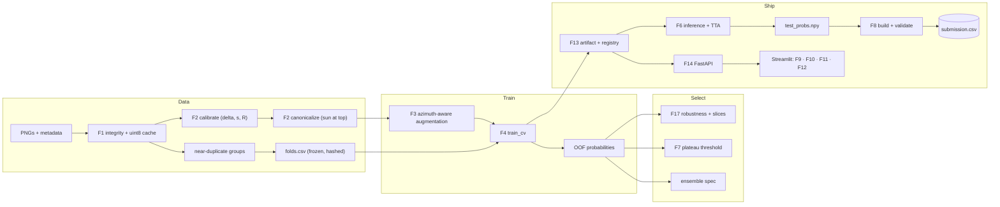

# PRD — Pareidolia: Illumination-Aware Lunar Relief Classifier

| | |
|---|---|
| **Status** | Draft v1.0 |
| **Date** | Thu 10 Sep 2026 |
| **Owner** | OPS lead (assign) |
| **Competition window** | 1–21 Sep 2026 |
| **Stated deadline** | Mon 21 Sep 2026, 23:59 (timezone to confirm, Q4) |
| **Internal hard stop** | Mon 21 Sep 2026, 18:00 local |
| **Final submission target** | Sat 19 Sep 2026 (latest Sun 20 Sep, 12:00) |
| **Source of truth for rationale** | `docs/pareidolia_playbook.md` — bracketed refs like [A3] point to its sections |
| **Related** | `docs/Roadmap.md` (schedule, gates, risks) · `AGENTS.md` (repo rules) · `.claude/skills/pareidolia-lunar-terrain/SKILL.md` (domain procedures) |

---

## 1. Summary

We are building two things on one shared core.

**The submission system** is a reproducible pipeline that classifies 2,000 hidden-label 256×256 grayscale lunar tiles as **Depth (0)** or **Rise (1)**, uses `sun_azimuth_angle` to resolve topographic inversion, and emits a validated `image_id,label` CSV scored by Balanced Accuracy.

**Pareidolia Explorer** is a small app (FastAPI + Streamlit) that serves the same model artifact, explains predictions, and demonstrates the illusion interactively through the Sun Simulator.

The central bet is to treat azimuth as a **transformation parameter**, not a feature: calibrate its convention empirically, rotate every image into a canonical sun-at-top frame, and train only with augmentations that respect the physics [A1, A4, C1].

---

## 2. Problem

### 2.1 Task facts

| Item | Value |
|---|---|
| Training data | 7,854 labelled PNGs; `train_metadata.csv` = `image_id, sun_azimuth_angle, label` |
| Evaluation data | 2,000 unlabelled PNGs; `test_metadata.csv` = `image_id, sun_azimuth_angle` |
| Input | 256×256, single channel, presumed one dominant feature per tile |
| Classes | 0 = Depth (craters, holes, depressions); 1 = Rise (mounds, hills, rocks, boulders) |
| Metric | Balanced Accuracy = ½ (recall₀ + recall₁) |
| Deliverable | One CSV, header exactly `image_id,label`, 2,000 rows, IDs keep `.png`, integer labels |
| Feedback loop | None. Labels are hidden; local cross-validation is the only quality signal |
| Absent metadata | Sun elevation, scene/source ID, coordinates, timestamps, ground sample distance |

### 2.2 Why this is hard

The label is a function of **(image, azimuth)** jointly, never of the image alone. A crater rotated 180° without updating its azimuth is pixel-for-pixel indistinguishable from a mound [A3]. From that single fact:

- Any pixels-only model has an irreducible error floor.
- The reflexive augmentations (random flips and rotations) silently inject label noise [B6].
- A cheap shadow-polarity shortcut exists, the organizers explicitly warn against relying on it, and the hidden set may be built to punish it [A5].
- Tiles cut from shared source images likely contain near-duplicates that inflate naive CV [B10].
- 7,854 samples means overfitting pressure, and a 2,000-image test set means roughly ±1 BA point of irreducible scoring noise [A2].

---

## 3. Goals and non-goals

### Goals

1. **Maximize expected** Balanced Accuracy on the hidden set, favouring robustness to distribution shift over sub-noise CV gains.
2. **Make submission failure structurally impossible**: an accepted, validated CSV by Sat 12 Sep, and the final one accepted well before the hard stop.
3. **Show the model learned the physics**, not the shortcut, through the shortcut audit, stress tests, and the Sun Simulator.
4. **Reproduce the final submission from a clean clone with one command.**

### Non-goals

- Detection or segmentation (no boxes, no masks) [A2].
- A production React frontend, unless Q6 confirms presentation is scored and modelling is ahead of schedule.
- Automated hyperparameter search as a primary method.
- Any use of external data, or of test images for training, beyond what the rules explicitly allow (Q2, Q3).
- Hand-labelling test images or hand-editing test predictions.

---

## 4. Users

| User | What they need | What it implies |
|---|---|---|
| Automated scorer | A file its strict parser accepts | F8 validator is P0 and cannot be bypassed |
| Team (DATA, MODEL, APP, OPS) | Comparable, trustworthy evidence | Frozen folds, one metric module, run manifests, shared tracker |
| Judges / reviewers (only if Q6 says there's a code, report, or demo deliverable) | A causal account plus a convincing demo | Ablation table, robustness report, Sun Simulator |
| Planetary scientist (aspirational) | Triage many tiles, surface the uncertain ones | F11 review queue |

---

## 5. Success metrics

All model metrics are computed only by `src/metrics.py`, on the frozen folds in `data/folds.csv`. Absolute BA targets are deliberately not fixed yet: they depend on how strong the shadow shortcut turns out to be (calibration concentration R), which is measured at M1. Targets marked *proposed* are revisited at M2.

| ID | Metric | Definition | Target |
|---|---|---|---|
| K1 | **OOF Balanced Accuracy** (primary) | Final ensemble, out-of-fold, at the frozen threshold | Beats the shortcut baseline (B1) and the naïve CNN (B3) with a group-level paired-bootstrap 95% CI that excludes zero, and by ≥ 1 pt |
| K2 | Shortcut-wrong BA | BA on OOF images the shortcut baseline gets wrong | Well above 0.5; *proposed* ≥ 0.65 |
| K3 | Inversion-stress BA | BA on validation images transformed by rot180-with-fixed-azimuth and by negation, labels flipped | *Proposed* ≥ K1 − 5 pts |
| K4 | Azimuth-shift degradation | BA drop when a validation fold is rotated by random angles with azimuths correctly updated | ≤ 1.0 pt |
| K5 | Worst-slice BA | Minimum BA across azimuth octant, brightness quartile, contrast quartile, morphological sub-type | Reported for every candidate; tie-breaker in selection |
| K6 | CAM shadow-mass fraction | Share of Grad-CAM mass inside the shadow mask | Tracked; at equal BA, prefer lower |
| K7 | Threshold stability | Spread of per-fold optimal thresholds; distance between empirical optimum and π₁ | Both ≤ 0.10, otherwise temperature-scale or fall back to π₁ |
| K8 | Test shortcut-agreement | Label-free agreement rate between final model and shortcut baseline on test | Recorded and interpreted per [A5]; no target |
| K9 | First accepted submission | Platform accepts a validator-passed baseline CSV | By Sat 12 Sep EOD |
| K10 | Final accepted submission | Validated, checklist-complete, confirmation screenshotted | Sat 19 Sep; no later than Sun 20 Sep 12:00 |
| K11 | Reproduction | `make reproduce` from a fresh clone reproduces recorded OOF BA | Within 0.2 pt, executed before Sat 19 Sep |
| K12 | App readiness | A newcomer can upload an image, set azimuth, and get an explained prediction; Sun Simulator coupled-rotation std of P(Rise) on presets | Stranger test passes; std ≤ 0.02 for canonical members |

**Reading K2 and K3 together.** They guard against different failures. K2 catches a model that is only a shadow-polarity detector. K3 catches a model that ignores azimuth and memorizes appearance. A polarity-only model passes K3 easily and fails K2, so neither metric is sufficient alone.

---

## 6. Functional requirements

Priorities: **P0** = no valid or competitive submission without it. **P1** = strongly expected (robustness evidence, demo, reproducibility). **P2** = only if time allows. Feature IDs F1–F15 follow the playbook [Part E]; F16 and F17 are added here to give baselines and the robustness suite their own acceptance criteria.

### 6.1 Data and physics core

**F1 — Data ingestion and integrity** · P0 · DATA
- `load_metadata(split)` asserts exact column names, row counts (7,854 / 2,000), no nulls, no duplicate IDs, and reads `image_id` as `str`.
- `verify_images()` confirms CSV↔disk correspondence in both directions, 256×256, single channel; records dtype and value range (uint8 vs uint16) and unique-value count; writes a cached anomaly report.
- `build_cache()` writes `train_images.npy` (7854, 256, 256) and `test_images.npy` (2000, 256, 256) as uint8 plus `index.json` mapping array position to `image_id`.
- `PareidoliaDataset(split, folds, transform, cfg)` returns `(image, azimuth_sincos, label)`.
- *Acceptance:* pytest covers wrong column, missing file, wrong size, and duplicate ID; `index.json` order matches the CSV; full cache loads in under 10 s. If images turn out to be uint16, the cache dtype and negation constant are decided at M1 and recorded in config.

**F2 — Illumination calibration and canonicalization** · P0 · DATA
- `calibrate(images, azimuths, labels)` returns offset δ, handedness s, concentration R, R under the rejected handedness, per-class R, and the angle between class modes; also run per azimuth octant to confirm the convention is stable across the dataset.
- `canonicalize(img, az, jitter_deg=0)` defaults to a single affine rotation with a √2 zoom, so every output pixel samples real image content at a constant scale (AD-8). An ablation mode keeps native scale with median-filled corners. Reflect padding is not permitted (Appendix A, item 3).
- `decanonicalize()` applies the inverse affine for Grad-CAM display.
- A validation figure shows per-class mean images before and after canonicalization.
- NaN or out-of-range azimuths are flagged; values wrap modulo 360. A `canonicalize: false` config path exists for ablations.
- *Acceptance:* synthetic-render tests recover a known (δ, s) within 3° with R > 0.95; rotate-then-update-azimuth yields the same canonical image (MAE < 1 grey level on the central disc); per-class canonical means show opposite-signed top-minus-bottom asymmetry; figure saved to `reports/figures/`.

**F3 — Azimuth-aware augmentation engine** · P0 · MODEL
- A `Sample(image, azimuth, label)` dataclass; every operator returns a `Sample`. Operators and their label/azimuth effects follow the SKILL's decision tables.
- Named policies in config: `policy_safe`, `policy_labelflip`, `policy_aggressive`.
- A visual debugger renders 16 augmented variants of one image annotated with resulting azimuth and label.
- A lint test fails the build if any library flip or rotation with non-zero probability appears outside `src/transforms.py`, or if `timm.data.create_transform(is_training=True)` is used (it flips by default).
- *Acceptance:* unit tests for rotation round-trips, canonical invariance under rotate-and-update, double-negation identity, flip azimuth updates checked against re-rendered synthetic images, and relief inversion under canonical vertical flip; the debugger grid is reviewed before the first training run with any new policy.

### 6.2 Training, evaluation, submission

**F4 — Model construction and training orchestrator** · P0 · MODEL
- `build_model(cfg)`: timm backbone (IN-22k-pretrained where available), `in_chans` 1 or 3, `drop_path_rate`, conditioning mode ∈ {none, concat, planes, film}.
- `build_loss(cfg)`: class-weighted cross-entropy with label smoothing; optional negation-consistency and rotation-equivariance terms with linear warm-up.
- `train_cv(cfg)`: bf16 AMP, `channels_last`, cosine schedule with warm-up, gradient clipping at 1.0, EMA, early stopping on validation BA, checkpoint every epoch plus best, automatic resume.
- Outputs `oof.npy`, fold checkpoints, and `run_manifest.json`.
- *Acceptance:* `python -m src.train --config configs/debug.yaml` completes end-to-end in under 5 minutes on a GPU; a killed run resumes from its last epoch; the manifest contains config hash, git SHA, seed, `folds_sha256`, and all metrics.

**F5 — Cross-validation and experiment tracking** · P0 · DATA / OPS
- `make_folds()` runs once: `StratifiedGroupKFold(n_splits=5)`, groups = connected components of the near-duplicate graph (perceptual hash plus embedding cosine similarity), strata = label × azimuth bin. It refuses to overwrite an existing file and writes the file's SHA-256 into config.
- `metrics.py` provides `balanced_accuracy`, `apply_threshold`, `sweep`, `plateau_threshold`, `per_fold_optima`, `slice_report`, and a group-level `paired_bootstrap`.
- Tracker logging per run, plus `scripts/compare_runs.py` printing a sorted table with seed standard deviations.
- *Acceptance:* per-fold class ratios and sizes are reported and reviewed; metric functions are tested against hand-computed examples; grouped-CV and random-CV scores are compared once and the gap is recorded.

**F16 — Baselines** · P0 · MODEL
- B0 constant predictor; B1 shortcut (canonical top-half vs bottom-half brightness); B2 LightGBM on the physical features in [C5] (asymmetry, shadow containment ratio, shadow elongation and offset, 16-bin radial profile, circularity, sun-elevation proxy, sin/cos azimuth); B3 naïve CNN on raw images with no azimuth and standard flips (deliberately wrong).
- *Acceptance:* all four logged on the frozen folds; B0 scores exactly 0.500 (metric sanity check); B2 feature importances saved.

**F17 — Robustness suite** · P0 for model selection · MODEL / DATA
- `make robustness RUN=<run_id>` produces the shortcut audit, inversion stress test, azimuth-shift test, shadow and centre occlusion tests, reliability diagram, slice report, and CAM shadow-mass fraction (once F9 exists) as `reports/robustness/<run_id>.md` and a tracker table.
- *Acceptance:* runs on any run with saved OOF and checkpoints in under 30 minutes; its outputs are the evidence cited at milestones M4 and M5.

**F6 — Inference and TTA engine** · P0 (TTA is P1) · MODEL
- `predict(artifact, images, azimuths, tta_policy)` calls the same preprocessing functions as training. Label-flipping TTA views are inverted (negation view contributes 1 − p). Averaging happens in logit space across TTA views, folds, and members, with frozen weights; temperature applied if fitted.
- Writes `test_probs_<timestamp>.npy` before any thresholding and never overwrites it.
- *Acceptance:* a parity test runs 100 training images through the validation path and the inference path with max |Δp| < 1e-6; each TTA view is shown not to reduce OOF BA before adoption.

**F7 — Balanced-accuracy threshold optimizer** · P0 · MODEL
- Sweeps 197 thresholds over OOF probabilities; returns the centre of the longest plateau within 0.001 of peak BA, the raw argmax, π₁, and per-fold optima.
- Warns when per-fold spread or |t* − π₁| exceeds 0.10.
- *Acceptance:* the chosen threshold is written to the frozen config block; a test asserts the submission path reads it and never calls the sweep.

**F8 — Submission builder and validator** · P0 · OPS
- Builds the CSV by joining on `image_id` (never by position), casts labels to `int`, writes with `index=False` and LF line endings.
- The validator enforces every check in [A7]; the label-inversion check (20 known training images through the exact production path) runs inside the builder so it cannot be skipped; a sanity report covers predicted class balance, shortcut agreement, agreement with the previous submission, and the probability histogram.
- Files are named `submissions/sub_<timestamp>_<artifact_id>.csv` and never overwritten.
- *Acceptance:* a test suite of deliberately broken files (index column, float and boolean labels, stripped `.png`, CRLF, BOM, missing row, duplicate ID, shuffled order, extra trailing newline) is rejected; a correct file passes; the builder aborts if the inversion check fails.

### 6.3 Explainability and application

**F9 — Explainability** · P1 · MODEL / APP
- Grad-CAM (or HiResCAM) on the canonical input, mapped back to the uploaded orientation via `decanonicalize`, overlaid at about 40% alpha with a perceptually uniform colormap.
- Shadow-mass fraction (CAM mass inside the Otsu shadow mask), averaged over validation and logged per model.
- *Acceptance:* overlays render in both frames; K6 is logged for every candidate in the final comparison.

**F10 — Sun Simulator (flagship)** · P1, becomes P0 if Q6 says the demo is scored · APP
- `POST /simulate` returns predictions for 72 azimuths (5° steps) from one batched forward pass; the slider reads from that sweep, with no request per tick.
- **Mode A (the illusion):** the image is fixed and the assumed azimuth sweeps. Expected: two plateaus with transitions near the true azimuth ± 90°.
- **Mode B (the equivariance check):** the image is rotated and the azimuth updated in lockstep. Expected: a constant prediction; the standard deviation across the sweep is displayed. For canonical members this holds by construction, so any visible variance signals a convention or corner bug; for the raw-frame FiLM member it is a genuine test of learned equivariance. Panels must say which is which.
- Three panels (original, canonical view at current azimuth, probability gauge), a polar plot of P(Rise) against azimuth, and 3–4 one-click presets (fresh crater, boulder, degraded ambiguous case).
- *Acceptance:* Mode B std ≤ 0.02 on presets for canonical members; Mode A shows the flip on presets; a preset loads in ≤ 5 s on CPU.

**F11 — Batch prediction and review queue** · P2 · APP
- Upload a zip of PNGs plus an azimuth CSV; process in batches of 64 with progress; sort by |p − threshold| so ambiguous cases lead; review grid with image, canonical view, prediction, confidence bar.
- **Compliance:** the manual override control exists for non-competition use only. Hand-editing test predictions is almost certainly prohibited, so the competition exporter refuses to write a file containing overrides; overrides export to a separate `_manual_overrides.csv`.
- *Acceptance:* a 2,000-image batch exports a file that passes F8.

**F12 — Robustness dashboard** · P2 · APP
- Renders F17 outputs: headline robustness metrics, side-by-side model comparison, reliability diagram, confusion matrix with clickable cells. The numbers themselves are P0 via F17; only this UI is P2.

**F14 — API and deployment** · P1 · APP
- FastAPI with Pydantic models; the model loads once at startup. Endpoints in §7.8. Input validation rejects non-256×256 images (or resizes with an explicit warning) and azimuths outside [0, 360).
- CPU-only Torch image around 1 GB; `docker compose up` starts API and UI together.
- *Acceptance:* works on a machine that has never seen the project; auto-generated `/docs` page available.

### 6.4 Engineering hygiene

**F13 — Model registry and artifact versioning** · P1 · OPS
- Self-contained artifact directories (§7.6); `artifacts/registry.json` holds a `production` pointer that both the app and `make submit` resolve; nightly sync to shared storage.
- *Acceptance:* an artifact directory copied alone to a fresh machine loads and predicts.

**F15 — Reproducibility harness** · P1, becomes P0 on Fri 18 Sep · OPS
- `make reproduce` verifies data placement, rebuilds the cache, loads the frozen folds, retrains all members with fixed seeds, checks OOF BA against the recorded value, runs inference with TTA, applies the frozen threshold, and writes and validates the CSV. It logs total runtime.
- *Acceptance:* executed from a fresh clone before Sat 19 Sep; OOF BA within 0.2 pt of the recorded value.

---

## 7. Data contracts and interfaces

### 7.1 Inputs

```
data/raw/train/*.png, data/raw/test/*.png          # gitignored
data/raw/train_metadata.csv  image_id:str, sun_azimuth_angle:float, label:int{0,1}
data/raw/test_metadata.csv   image_id:str, sun_azimuth_angle:float
```

### 7.2 Cache

```
data/processed/train_images.npy   uint8 (7854, 256, 256)
data/processed/test_images.npy    uint8 (2000, 256, 256)
data/processed/index.json         {"train": [image_id, ...], "test": [image_id, ...]}   # array order
```

### 7.3 Folds

`data/folds.csv` with columns `image_id, fold, group_id`, generated once and committed. Its SHA-256 is recorded in config and in every run manifest.

### 7.4 Frozen configuration block

```yaml
# configs/config.yaml — the `frozen:` block changes only via PR with human approval
frozen:
  class_map: {0: depth, 1: rise}
  prior_pi1: null                 # Phase 1.3
  norm: {mean: null, std: null}   # Phase 1.11, on the 0–255 scale
  calibration:
    delta_deg: null               # Phase 1.5
    handedness: null              # +1 or -1
    R: null
    convention: toward_sun_ccw_from_right   # see SKILL §1
  canonical: {mode: zoom_sqrt2}   # AD-8
  folds_sha256: null              # Phase 1.9
  threshold: null                 # Phase 6.8, plateau centre
```

### 7.5 Run manifest

`experiments/<run_id>/run_manifest.json`:

```json
{"run_id": "20260914-2210_convnext_t_labelflip_s1", "parent_run": "20260913-2330_convnext_t_ref_s0",
 "config_hash": "…", "git_sha": "…", "seed": 1, "folds_sha256": "…",
 "metrics": {"oof_ba": 0.0, "oof_auc": 0.0, "per_fold_ba": [], "threshold": 0.0,
             "shortcut_wrong_ba": null, "inversion_stress_ba": null, "az_shift_delta": null,
             "cam_shadow_mass": null},
 "oof_path": "experiments/<run_id>/oof.npy", "started_at": "…", "finished_at": "…", "gpu": "…"}
```

### 7.6 Model artifact

```
artifacts/<YYYYMMDD>_<name>_ba<0.xxxx>/
  weights/fold0.pt … fold4.pt      (or model.onnx after parity check)
  config.yaml
  norm_stats.json                  {"mean": …, "std": …}
  calibration.json                 {"delta_deg": …, "handedness": …, "R": …, "convention": "toward_sun_ccw_from_right"}
  threshold.json                   {"threshold": …, "method": "plateau_centre", "pi1": …, "per_fold": […]}
  class_map.json                   {"0": "depth", "1": "rise"}
  metrics.json                     (K1–K7 for this artifact)
  git_sha.txt
artifacts/registry.json            {"production": "<dir>", "candidates": ["<dir>", …]}   # tracked in git
```

### 7.7 Submission

UTF-8 without BOM, LF endings, exactly one trailing newline, header `image_id,label`, 2,000 rows in `test_metadata.csv` order, IDs with `.png`, labels as the literal characters `0` or `1`.

### 7.8 API

| Method | Path | Request | Response |
|---|---|---|---|
| GET | `/health` | — | `{status, model_loaded, artifact_id}` |
| GET | `/model-info` | — | `{artifact_id, members, oof_ba, threshold, calibration, norm_stats, git_sha, is_demo_artifact}` |
| POST | `/predict` | multipart: `image` (PNG), `azimuth` (float) | `{label, label_name, p_rise, threshold, canonical_png_b64}` |
| POST | `/predict/batch` | multipart: `zip` of PNGs, `metadata` CSV | streamed rows `{image_id, p_rise, label, margin}`; final validated CSV |
| POST | `/explain` | `image`, `azimuth` | `{p_rise, label, cam_original_png_b64, cam_canonical_png_b64, shadow_mass_fraction}` |
| POST | `/simulate` | `image`, `azimuth`, `mode` ∈ {fixed_image, coupled_rotation}, `step_deg` = 5 | `{azimuths[72], p_rise[72], std, canonical_thumbs_b64[]}` |

---

## 8. Non-functional requirements

**Correctness invariants.** Label = f(image, azimuth); azimuth is always encoded as (sin, cos) and summarized with circular statistics; one implementation each of preprocessing, the metric, the threshold rule, and the class map; submission rows joined on `image_id`. The full list of rules is in `AGENTS.md` §5.

**Reproducibility.** Seeds set in every entry point; pinned dependencies (Python 3.11); `folds_sha256` recorded everywhere; deterministic mode for `make reproduce` (`cudnn.deterministic=True`, `cudnn.benchmark=False`, `torch.use_deterministic_algorithms(True)`, `CUBLAS_WORKSPACE_CONFIG=:4096:8`).

**Performance.** ConvNeXt-Tiny epoch on about 6,300 images at 256×256 in roughly a minute on a modern GPU; above 3 minutes indicates an I/O or preprocessing bug [B13]. Full test inference (2,000 images × TTA × ensemble) under 15 minutes on GPU (*proposed*). On a 4-core CPU: `/predict` p95 ≤ 1.5 s and `/simulate` ≤ 5 s (*proposed*); if the full ensemble is too slow, the app may serve a single-backbone demo artifact, and `/model-info` must report `is_demo_artifact: true`.

**Resilience.** Checkpoints every epoch to persistent storage with automatic resume; artifacts and `test_probs_*.npy` synced nightly; previous known-good submission retained.

**Compliance and security.** No external data or transductive use of test images unless Q2/Q3 allow it; no manual edits to test predictions; tracker and cloud keys only via environment variables, never committed.

---

## 9. Architecture



---

## 10. Key decisions

| ID | Decision | Rationale | Revisit if |
|---|---|---|---|
| AD-1 | Canonicalization is the primary use of azimuth; keep one raw-frame FiLM-conditioned member as a hedge | Removes the ambiguity, neutralizes azimuth shift, simplifies augmentation [C1] | Canonical on/off ablation (E2) gains < 1 pt, which suggests a calibration error |
| AD-2 | Azimuth is always (sin, cos); statistics are circular | 359° and 1° are neighbours [A4] | Never |
| AD-3 | 5-fold `StratifiedGroupKFold`, groups from near-duplicates, strata label × azimuth bin; frozen at M1 | CV is the only signal; leakage would corrupt every decision [B10] | Never after M1 |
| AD-4 | Select and report on OOF BA at the plateau threshold; AUC is diagnostic only | Optimize what is scored [A6] | Never |
| AD-5 | Final model is the fold-ensemble; full-data refits only as extra averaged members | It is exactly what OOF measured [Phase 8.2] | Never |
| AD-6 | FastAPI + Streamlit; no React | Two to three days of UI work would come out of modelling [Part F] | Q6 says presentation is scored and M5 is reached early |
| AD-7 | CPU-only Torch demo container; artifact mounted during development, baked into the final demo image | Small image, portable demo | — |
| AD-8 | Canonicalize with one affine warp: rotation plus √2 zoom | No synthesized pixels at any angle, constant scale for every image (no azimuth-dependent scale leak), single interpolation | Visual audit shows many dominant features extending beyond ~90 px from centre; then use native scale with median-filled corners |
| AD-9 | Negation is `255 − x` on uint8, implemented once in `transforms.py` | `img.max() − img` adds a per-image offset | Images are uint16 (F1) |
| AD-10 | Every run records `folds_sha256`; ensembling refuses mismatched hashes | Incomparable predictions cannot be ensembled [Phase 6.1] | Never |
| AD-11 | Adopting a change requires ≥ 3 seeds and a group-level paired bootstrap on OOF | Seed σ is 0.3–0.8 pt [B12]; paired tests are sharper than unpaired rules of thumb | — |

---

## 11. Assumptions and open questions

### Assumptions (each verified or falsified by M1)

1. ImageNet-pretrained weights are allowed (Q1).
2. Each tile has one dominant, roughly centred feature (visual audit, Phase 1.7).
3. The azimuth convention is consistent across the dataset (per-octant calibration).
4. At least one dry-run submission is possible (Q5).
5. The team has at least one modern GPU for the full 12 days.
6. Images are 8-bit (F1).

### Open questions — owner OPS, ask today, record answers in `docs/rules.md`

| ID | Question | If the answer is unfavourable |
|---|---|---|
| Q1 | Are ImageNet-pretrained weights permitted? | SSL pretraining (DINO or MAE on train + test images) becomes P0; smaller models; heavier augmentation |
| Q2 | Is external data permitted? | Plan assumes no; nothing changes |
| Q3 | May unlabeled test images be used for consistency losses, test-time BN adaptation, or pseudo-labels? | Drop those three; TTA remains, since it is ordinary inference |
| Q4 | Deadline timezone? | Hard stop stays 18:00 local; recompute if the deadline is earlier in local time |
| Q5 | How many submissions; any feedback; is the last or a chosen submission scored? | If only one is allowed, M2 becomes offline validation only and the final upload is the single shot |
| Q6 | Is a code, report, or demo deliverable required, and is presentation scored? | If scored: F10 becomes P0 and the report gets a dedicated day |
| Q7 | Required file name for the CSV? | Encode it in `submit.py` |
| Q8 | Is code review or reproduction required for prizes? | F15 becomes P0 from M3 onward |

---

## 12. Risks

The full register (R1–R15) with owners and burn-down by milestone lives in `docs/Roadmap.md` §9. The ones that can sink the project outright are a rejected submission file (R1), inverted class mapping (R2), a miscalibrated azimuth convention (R3), and CV optimism from near-duplicates (R4); each is retired by a named gate before modelling decisions depend on it.

---

## 13. Release criteria (final submission)

1. All P0 acceptance criteria met.
2. K9, K10, and K11 satisfied.
3. The final pre-submission checklist [G4] completed aloud with a second person watching.
4. Repository tagged at the producing commit; rollback file and `test_probs_*.npy` backed up.

---

## Appendix A — Playbook errata and clarifications

Items marked ✅ were checked numerically with synthetic Lambertian renders of domes and pits.

1. ✅ **Vertical flip in the canonical frame.** The [A3] table marks "mirror across the perpendicular axis, azimuth unchanged" as invalid, while [C2] says a canonical vertical flip flips the label. Both are right once stated precisely: it is invalid *if the label is kept* and an approximate counterfactual *if the label is flipped*, since a vertical flip equals a 180° rotation composed with a mirror across the sun axis. The text's reference to "row seven" should read row eight.
2. **Photometric negation constant.** Use `255 − x` (uint8) or `−x` after normalization, not `img.max() − img`, which adds a per-image offset tied to the brightest pixel.
3. ✅ **Canonicalization corners.** Option (c) in [C1] cannot preserve the full field of view without synthesized pixels: upscaling before rotating is a zoom (equivalent to option a), and padding is option (b). Reflect padding is actively harmful here, because mirroring across a tile edge perpendicular to the sun reverses the shading order and plants relief-inverted ghosts in the corners (a mirrored dome reads as a pit). Default to the √2-zoom warp (AD-8).
4. **Constant scale.** When cropping to valid pixels, always use the fixed inscribed region, never the angle-dependent maximal square; otherwise apparent feature size would encode azimuth.
5. **Rotation-equivariance loss under canonicalization.** Both views canonicalize to the same pixels up to interpolation, so the loss is near zero by construction in the canonical pipeline. It matters for the raw-frame FiLM member; the negation-consistency loss is the substantive one for canonical models.
6. **BatchNorm-specific advice.** Test-time BN adaptation [Phase 6.7] and the BN argument for balanced sampling [A6] only apply to BatchNorm backbones such as ResNet and EfficientNet. ConvNeXt and Swin use LayerNorm.
7. ✅ **Flip formulas depend on the angle convention.** The reflection θ → 180° − θ in [C2] assumes angles measured from the +x axis. The SKILL fixes one convention for the whole codebase and tests it.
8. **What the inversion stress test measures.** It detects azimuth-blind appearance memorization; the shortcut audit detects polarity-only reliance. Both are required (see K2/K3 note).
9. **Comparing models.** Two models scored on the same OOF set are a paired comparison; use a group-level paired bootstrap rather than the unpaired "±1.5 pt is noise" rule, and keep multi-seed runs for training noise.
10. **timm defaults.** `timm.data.create_transform(is_training=True)` includes random horizontal flips by default; avoid it.
11. **Review-queue overrides.** The override control in [F11] must not feed a competition submission (hand-labelling of test data).
12. **Calibration mode assignment.** Use labels to decide which mode points at the sun: for Rise, dark-minus-bright points away from the sun; for Depth, toward it.
13. **Schedule.** The playbook's calendar assumed a 6 Sep start; `docs/Roadmap.md` re-baselines to 10 Sep.

## Appendix B — Glossary

- **BA** — Balanced Accuracy, the mean of per-class recalls.
- **OOF** — out-of-fold predictions: every training image predicted by the fold model that did not train on it.
- **π₁** — training prior of class 1 (Rise); the BA-optimal threshold on calibrated posteriors.
- **δ, s** — calibration offset and handedness: θ_sun = s · azimuth + δ in image coordinates.
- **R** — mean resultant length of the calibration residuals; near 1 means shading polarity is nearly deterministic given class and azimuth.
- **Canonical frame** — every image rotated so the sun is at the top.
- **Shortcut baseline (B1)** — canonical top-half minus bottom-half brightness; positive predicts Rise.
- **Shadow-mass fraction** — share of Grad-CAM mass inside the shadow mask.
- **Fold-ensemble** — the average of the five fold models, i.e. exactly what OOF measured.
