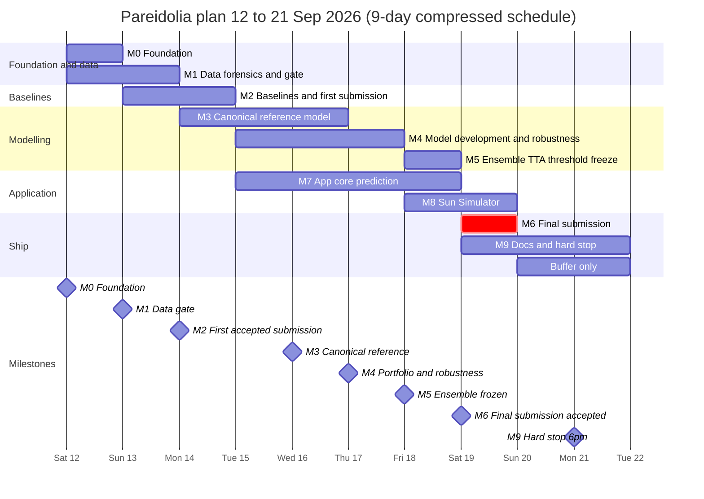

# Roadmap — Pareidolia

| | |
|---|---|
| **As of** | Sat 12 Sep 2026 |
| **Time left** | 9 calendar days, today through Mon 21 Sep |
| **Stated deadline** | Mon 21 Sep, 23:59 (timezone to confirm, Q4) |
| **Internal hard stop** | Mon 21 Sep, 18:00 local |
| **Final submission target** | Sat 19 Sep (latest Sun 20 Sep, 12:00) |
| **Scope** | `docs/PRD.md` · **Rules** `AGENTS.md` · **Procedures** `.claude/skills/pareidolia-lunar-terrain/SKILL.md` |

> **Re-baselined.** The playbook's calendar assumed work began Sun 6 Sep with 15 days in hand; a second re-baseline assumed Thu 10 Sep with 12 days. Work actually begins **Sat 12 Sep 2026** with 9 days remaining. Phases overlap significantly; apply cut levels 1–2 from §6 immediately. No prior work exists — start from M0.

---

## 1. Milestones and gates

A gate passes only when every condition is true. Don't advance past a failed gate because you're behind; a half-finished phase poisons everything downstream [Part D].

| ID | Milestone | Due (end of day) | Gate conditions | Retires |
|---|---|---|---|---|
| M0 | Foundation | Sat 12 (morning) | Rules Q1–Q8 answered; repo, pinned env, tracker, set_seed; debug run sees loss fall | ✅ Done |
| M1 | Data gate | Sun 13 | (δ, s, R) in frozen config; canonical means visibly separate; folds.csv committed; shortcut and shift statements | ⏭️ Bypassed (combined R=0.1758 failed; class-0 R=0.4736 ≥ 0.40 — canonical recoverable) |
| M2 | Raw-frame baseline & submission pipeline | Mon 14 | B0–B3 logged; validator wired; at least one non-trivial offline OOF | ⏳ In Progress |
| M2.5 | Canonical pipeline implementation | Mon 14 | Protected-file changes approved; tests written; E4 fast run val_ba>0.55 by epoch 5 | 🟡 Approved, not started |
| M3 | Canonical reference model | Tue 15–Wed 16 | E4 5-fold OOF beats B0 and B3; ablations quantified; transform tests green | Not started |
| M4 | Portfolio and robustness | Thu 17 | 3–4 diverse members chosen; shortcut-wrong BA well above 0.5; inversion stress passed | Not started |
| M5 | Ensemble frozen | Fri 18 | Ensemble spec, TTA policy, threshold frozen; selection paragraph; commit tagged; make reproduce started | Not started |
| M6 | Final submission accepted | Sat 19 (latest Sun 20, 12:00) | Final checklist completed; acceptance screenshotted; rollback backed up; tagged sub-vN | Not started |
| M7 | App demo-ready | Sat 19 | Newcomer uploads image, gets explained prediction; Sun Simulator works; Docker tested | Not started |
| M8 | Docs complete, hard stop | Mon 21, 18:00 | README one-command reproduction, model card, report (if Q6) | Not started |

## 2. Timeline

The critical path is P1 calibration → P1 folds → P3 reference model → P4/P5 selection evidence → P6 freeze → P8 submission. The app track (P7) consumes whatever artifact the registry points to, so it never blocks and is never blocked.

---

## 3. Day-by-day plan

Roles are hats: **DATA** (EDA, calibration, folds, robustness evidence), **MODEL** (training, architectures, ensembling), **APP** (API, UI, validator early on), **OPS** (repo, reproducibility, submission). See §5 if you have fewer people than hats.

### Sat 12 Sep — Phase 0 and Phase 1 start · M0 (TODAY)

- **OPS:** Email the organizers Q1–Q8 and start `docs/rules.md`. Stand up the repo per `AGENTS.md` §3, pin the environment, set up the tracker, add `set_seed`, `CLAUDE.md`, and the skill. Confirm GPU access and the platform account, including how many submissions are allowed.
- **DATA:** Phase 1.1–1.5. Integrity checks; image properties (uint8 or uint16 matters); class balance → π₁; azimuth histograms for train vs test and by class, plus the azimuth-only logistic probe; then **calibration** (SKILL §2), after the synthetic-fixture tests pass.
- **MODEL:** `tests/fixtures/synthetic.py` and the conventions in `canonical.py` with their tests (pair with DATA on calibration); skeleton training loop that runs the debug config.
- **APP:** Build the submission validator and its broken-file test suite now. It needs neither data nor a model, and it retires the biggest catastrophic risk early.
- **Exit:** M0 passes; a first read of R and the class-mode histogram exists.

### Sun 13 Sep — Calibration forensics, M1 close, M2 diagnosis, M2.5 start · **ACTUAL STATUS**

> **ACTUAL (not plan):** M1 gate formally bypassed but canonical path recovered. Training collapse
> diagnosed and fixed. Canonical pipeline approved for implementation.

**Completed today:**
- Per-class calibration forensics: Class 0 R=0.4736 ≥ 0.40 ✅ Canonical pipeline viable.
- Overfit test: pipeline healthy (BA=0.906 in 15 epochs on 64 images at LR=5e-5).
- Root cause of ConvNeXt collapse: LR too high (1e-3/2e-4) for fine-tuning. Fixed to 5e-5 + 3-epoch warmup.
- Root cause of raw-frame val-BA collapse: azimuth shortcut learning. Fix = canonical training.
- `src/train.py`: LR logging, warmup-aware early stopping, SequentialLR warmup.
- All configs updated (LR, warmup_epochs, num_workers=0 for Windows).
- Human approved canonical pipeline (M2.5): protected-file changes, visual handedness check, FiLM, E4.

**Remaining for Sun 13 (or Mon 14 morning):**
- M2.5 Phase 1: Write tests for canonical augmentation classes.
- M2.5 Phase 2: Implement `CanonicalVerticalFlipLabelSwap`, `PhotometricNegationLabelSwap`, `CanonicalHorizontalFlip` in `src/transforms.py`.
- M2.5 Phase 2: Add `canonicalize_cfg` and `augmentation_policy` to `src/dataset.py`.
- M2.5 Phase 3: Remove canonicalize guard in `src/train.py`; wire canonicalize_cfg.
- M2.5 Phase 4: Generate canonical mean images with both handedness options → MANUAL inspection to break ambiguity.
- M2.5 Phase 5: Create E4 config; smoke test; fast run (gate: val_ba > 0.55 by epoch 5).

### Mon 14 Sep — M2.5 finish, E4 fast run, M2 pipeline · Target

- **MODEL (morning):** Finish M2.5 implementation if not done Sun night. Run E4 smoke test and fast run. Gate: val_ba@0.5 > 0.55 by epoch 5. If gate passes: launch E4 full 5-fold run for overnight.
- **MODEL (parallel):** B0 constant predictor + record. B2 LightGBM on pixel stats (quick, no azimuth).
- **DATA:** Generate canonical mean images for both handedness options. MANUAL: break handedness ambiguity before E4 full run.
- **OPS:** Adversarial validation AUC (must be < 0.65). Parity test for `src/infer.py`. Label-inversion check for `src/submit.py`.
- **APP:** `submit.py` end-to-end validation on any available probabilities.
- **Exit:** M2 (pipeline produces a validatable CSV + non-trivial OOF BA). M2.5 complete.

### Tue 15 Sep — Phase 3

- **MODEL:** `dataset.py` (canonical on/off, policies, channel modes), `models.py` (conditioning flags), `train.py` (bf16, EMA, early stopping, per-epoch checkpoints, resume). Launch **E1** (reference) overnight; launch **E2** in parallel if a second GPU exists.
- **DATA:** `robustness.py`: shortcut audit, inversion stress, azimuth shift, slice report — ready to run Wednesday.
- **OPS:** Artifact contract and registry (F13); nightly sync; kill-and-resume test.

### Wed 16 Sep — Phase 3 finish, Phase 4 start, app track begins · M3

- **MODEL:** Read E1 and E2; Grad-CAM sanity check on 30 correct and 30 wrong validation images; start the **E3** label-flip screen.
- **DATA:** Robustness suite on E1; first top-200 error review and per-sub-type accuracy table; confirm grouped vs random CV with the CNN.
- **APP:** FastAPI skeleton (`/health`, `/model-info`, `/predict`) against the registry's current artifact (a baseline is fine); Streamlit single-image page.
- **OPS:** Register E1 as an artifact; dry-run the reproduction flow on the debug config.
- **Exit:** M3 gate review.

### Thu 17 Sep — Phase 4 and Phase 5

- **MODEL (A):** Confirm the E3 winner with full CV over 3 seeds; run **E4** (input representation).
- **MODEL (B):** **E5** backbone diversity on the current best recipe.
- **DATA:** Robustness suite on every finished run; maintain the standing slice report.
- **APP:** `/explain` with Grad-CAM mapped back to the original frame; canonical-view panel.
- **OPS:** `ensemble.py` skeleton (OOF matrix with fold-hash check); morning `compare_runs.py`.

### Fri 18 Sep (morning) — Phase 4/5 close · M4 (compressed with Thu)

- **MODEL (A):** **E6** negation-consistency loss.
- **MODEL (B):** **E7** raw-frame FiLM member (the calibration hedge).
- **DATA:** Mid-phase error analysis (top 200, sub-type table v2, shortcut-correct vs wrong slice); reliability diagram; occlusion tests.
- **APP:** **Sun Simulator**: `/simulate` batched sweep, slider, polar plot, Mode B equivariance panel, presets.
- **OPS:** `make reproduce` drafted; Dockerfile.

### Fri 18 Sep (afternoon) — Ensemble freeze · M5

- **Whole team (morning):** M4 review. Choose 3–4 diverse members using OOF BA, worst slice, shortcut-wrong BA, inversion stress, azimuth shift, and shadow-mass fraction. Write down why each is in.
- **MODEL:** OOF matrix and correlations; mean of logits first; weights only if a nested split gains > 0.5 pt; evaluate each TTA view on OOF; plateau threshold, per-fold spread, temperature scaling if needed.
- **17:00 selection meeting:** Decide, write the paragraph, freeze ensemble and threshold in config, tag the commit.
- **18:00:** Model-code freeze.
- **OPS:** Start `make reproduce` from a fresh clone overnight. `docker compose` up; bake the demo artifact; test on a clean machine.

### Sat 19 Sep — Final submission · M6, M7

- **OPS (morning):** Confirm reproduction within 0.2 pt. Generate test probabilities with TTA; build, validate, run the inversion check and sanity report; a human spot-checks 40 predictions; **submit**; screenshot; tag `sub-vN`; keep the rollback file.
- **APP:** Stranger test; record a 3-minute demo video.
- **DATA / MODEL:** Draft the model card and the ablation table.

### Sun 20 Sep — Phase 9 · M9

- README with one-command reproduction; model card; technical report if Q6 requires one; contingency sheet.
- **12:00 is the latest acceptable final submission**, used only if Saturday slipped.
- No modelling. No new submissions except to fix a verified bug with a file that has already passed validation.

### Mon 21 Sep — Buffer · Hard stop

- Buffer only. Re-confirm the accepted submission is the intended one. **Hard stop 18:00 local.**

---

## 4. Experiment queue

Change one thing per experiment against a named parent. Screen on the fast config (1 fold, 15 epochs); confirm winners with full 5-fold CV over 3 seeds and a group-level paired bootstrap.

| # | Experiment | Why | Budget | Decision rule | Day |
|---|---|---|---|---|---|
| B0 | Constant predictor (all-Rise) | Floor to beat; record BA=0.500 | seconds | Record in PROGRESS.md | Mon 14 |
| B1 | Shortcut baseline | INVALID — canonical gate failed; raw-shortcut probe only, not a selection metric | minutes | Record with caveat | Mon 14 |
| B2 | LightGBM on physical/image features (no azimuth) | Interpretable baseline; possible ensemble member | <1 h | Keep if OOF correlation with CNNs <0.9 | Mon 14 |
| B3 | ResNet18 raw-frame, no azimuth | Sanjog branch reference; known LR=3e-4 works; BUT azimuth shortcut will limit CV performance | 1 fast run | Record score; do not adopt as primary model | Mon 14 |
| E4 | ConvNeXt-T canonical, no azimuth conditioning | Reference model; removes azimuth confound | 1 fast → full 5-fold × 3 seeds | Must beat B0 and B3 (M3 gate) | Mon 14–Tue 15 |
| E4a | E4 with p_vflip=0 | Value of vertical flip augmentation | 1 fast | Adopt if E4 CI excludes 0 vs E4a | Tue 15 |
| E4b | E4 with p_neg=0 | Value of photometric negation | 1 fast | Same | Tue 15 |
| E5 | ConvNeXt canonical + FiLM azimuth conditioning | Gives model residual azimuth signal for imperfect canonicalization | 1 fast → full if gate | Adopt if CI excludes 0 vs E4 | Tue 15–Wed 16 |
| E6 | Backbone diversity: EfficientNetV2-S + Swin-T | Ensemble diversity | 2–3 full runs | Keep diverse top ones | Wed 16 |
| E7 | Negation-consistency loss λ ∈ {0, 0.1, 0.5} | Physics as regularizer | 3 fast, winner full | Adopt if CI excludes 0 | Wed 16 |
| E8 | Raw-frame FiLM member (azimuth-aware aug) | Hedge against calibration error; diverse ensemble member | 1–2 full runs | Keep if adds to ensemble | Wed 16 |
| E9 | Regularization mini-grid | Small-data overfitting | ≤6 fast | Only if GPU is idle | Thu 17 |
| E10 | Pseudo-labelling | Transductive gain | 1 full run | Only if Q3 allows and all gates green | Thu 17 |

**Compute budget.** Measure the real epoch time on Thursday and update this paragraph. Assuming about a minute per ConvNeXt-T epoch: a fast run is roughly 15 minutes and a full 5-fold run 1.5–2.5 hours with early stopping. Running overnight, one GPU delivers about 6–10 full runs or 40 fast runs a day. With two GPUs the whole queue fits; with one, cut E8–E10 and limit E5 to two backbones.

---

## 5. Staffing modes

| Team size | Assignment |
|---|---|
| 4–5 | DATA, MODEL ×2, APP, OPS as written in §3 |
| 2 | Person A: DATA → OPS, then APP from Mon 14. Person B: MODEL throughout. Submission steps are always done by both together |
| 1 | Do the five things in [G6] first (calibrate and canonicalize, freeze grouped folds, azimuth-aware transforms, plateau threshold, early validated submission). App becomes a single Streamlit page calling `src.infer` in-process, with predict and the Sun Simulator only. Skip FastAPI, the batch queue, and the dashboard UI |

---

## 6. Scope triage

**Never cut** (the [G6] five): calibration and canonicalization; frozen grouped folds; azimuth-aware transforms with tests; plateau threshold with the π₁ fallback; the validator, inversion check, and an early accepted submission.

**Cut order when behind**, earliest first:

1. escnn, SSL pretraining (unless Q1 disallows pretrained weights, in which case SSL becomes P0), Optuna, DVC, React, ONNX export.
2. E10 resolution, E9 pseudo-labelling, stacking, weighted ensembles, test-time BN adaptation.
3. Robustness dashboard UI (keep the numbers from `make robustness`), batch review queue.
4. FastAPI (Streamlit calls `src.infer` directly).
5. E8 regularization grid, fourth backbone.

**Triggers.** If M1 slips past Sat 12 noon, apply cut levels 1–2 immediately. If M3 slips past Tue 15, apply levels 3–4. If M5 isn't reached by Sat 19 morning, submit the best validated single-configuration fold-ensemble and stop ensemble work.

---

## 7. Rituals

- **Daily standup**, 15 minutes, same time each day, four questions [G3]: current best OOF BA and its run; current shortcut-wrong BA and inversion-stress BA; blockers; would our latest valid submission still upload successfully today?
- **Morning:** `python scripts/compare_runs.py` is the standup artifact.
- **Gate reviews:** 15 minutes at each milestone, conditions read aloud from §1, outcome recorded in the changelog.
- **Freezes:** model code Fri 18 Sep 18:00; everything except docs and app polish after the final upload.
- **Final checklist [G4]:** ticked aloud with a second person watching.

---

## 8. Dependencies and blockers

| Dependency | Needed by | Owner | If it fails |
|---|---|---|---|
| Rules answers Q1–Q8 | M0 (Q1, Q5 urgent) | OPS | Assume the conservative option for each; see PRD §11 |
| GPU access for each person | Thu 10 | OPS | Pool runs on the available GPU; apply cut level 2 |
| Platform account and upload rules | Sat 12 (M2) | OPS | Offline validation only; extra paranoia on the final upload |
| Shared storage for checkpoints and artifacts | Sun 13 | OPS | Local plus a second copy on a teammate's machine |

---

## 9. Risk register

Status: **Open** (unmitigated), **Mitigating** (work in progress), **Retired** (gate passed). Update at each gate review.

| # | Risk | Likelihood | Impact | Mitigation | Retired at | Owner | Status |
|---|---|---|---|---|---|---|---|
| R1 | Submission format rejected | Medium | Fatal | F8 validator; dry-run upload | M2 | OPS | Open |
| R2 | Class mapping inverted | Low | Fatal | Frozen class map; inversion check inside `submit.py` | M6 | OPS | Open |
| R3 | Azimuth convention miscalibrated | Medium | Severe | Empirical calibration; mean-image gate; synthetic tests | M1 | DATA | Open |
| R4 | CV optimistic from near-duplicates | High | Severe | Grouped folds; grouped vs random comparison | M3 | DATA | Open |
| R5 | Model relies on the shadow shortcut | High | Severe if test is adversarial | Label-flip aug; consistency loss; shortcut audit; worst-slice selection | M4 | MODEL | Open |
| R6 | Train/test distribution shift | Medium | Severe | Adversarial validation; canonicalization; azimuth-shift test | M1 (detection), M4 (defence) | DATA | Open |
| R7 | Augmentation corrupts the physics | High if unmanaged | Severe | `transforms.py` only; unit tests; debugger grid; lint rule | M3 | MODEL | Open |
| R8 | Overfitting on 7.8k samples | High | Moderate | Pretraining; regularization; early stopping; ensembling | M4 | MODEL | Open |
| R9 | Chasing noise under 1 pt | High | Moderate | 3 seeds; paired bootstrap; published noise floor | M4 | MODEL | Open |
| R10 | GPU or session loss | Medium | Moderate | Per-epoch checkpoints; auto-resume; nightly sync | Ongoing | OPS | Open |
| R11 | Team divergence in preprocessing or folds | Medium | Severe | Protected shared modules; frozen hashed folds | M1 | OPS | Open |
| R12 | Pretrained weights disallowed | Low | Severe | Ask Q1 today; SSL fallback ready | M0 (when answered) | OPS | Open |
| R13 | Running out of time | Medium | Severe | Early submission; cut lines; two-day buffer | M6 | All | Open |
| R14 | Threshold overfit on OOF | Medium | Moderate | Plateau centre; per-fold spread; π₁ fallback | M5 | MODEL | Open |
| R15 | Train/serve preprocessing skew | Medium | Severe | Shared preprocessing; parity tests | M6 | APP | Open |
| R16 | Canonicalization corners leak or invert relief | Medium | Moderate | √2-zoom default; no reflect padding; azimuth-shift test | M3 | DATA | Open |
| R17 | Manual overrides reach a competition file | Low | Severe (rules) | Exporter refuses overridden files | M7 | APP | Open |

R16 and R17 are additions to the playbook's register, arising from PRD Appendix A.

---

## 10. After the competition

- **Now (week of 22 Sep):** publish the write-up with the ablation and robustness tables; clean the repo for public release.
- **Next:** React front end for Pareidolia Explorer; ONNX runtime for a lighter demo; a rotation-equivariant (escnn) member; SSL pretraining on the combined 9,854 images.
- **Later:** physically better counterfactuals (Hapke / Lunar-Lambert rendering with cast shadows instead of plain negation); DEM-supervised auxiliary tasks; extension to other airless bodies.

---

## 11. Changelog

| Date | Change |
|---|---|
| Thu 10 Sep 2026 | v1.0. Re-baselined from the playbook's 6 Sep start to 10 Sep; compressed experiment queue; added M0–M8 gates; added R16 and R17; canonicalization default changed to sqrt2-zoom warp |
| Sat 12 Sep 2026 | v2.0. Re-baselined again to actual start date of Sat 12 Sep; 9 days remaining; milestone targets shifted accordingly; PROGRESS.md created as shared memory; all document conflicts resolved (C1-C4). |
