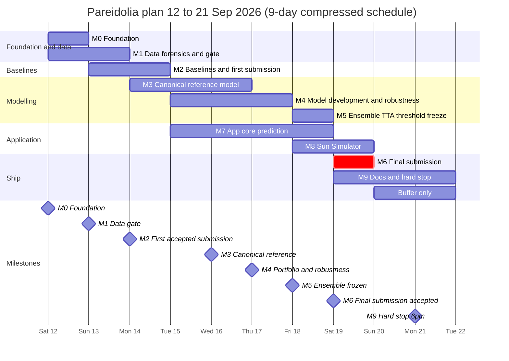

# Roadmap — Pareidolia

| | |
|---|---|
| **As of** | Sat 12 Sep 2026 |
| **Time left** | 9 calendar days, today through Mon 21 Sep |
| **Stated deadline** | Mon 21 Sep, 23:59 (timezone to confirm, Q4) |
| **Internal hard stop** | Mon 21 Sep, 18:00 local |
| **Final submission target** | Sat 19 Sep (latest Sun 20 Sep, 12:00) |
| **Scope** | `docs/PRD.md` · **Rules** `AGENTS.md` · **Procedures** `.claude/skills/pareidolia-lunar-terrain/SKILL.md` |

> **Re-baselined.** The playbook's calendar assumed work began Sun 6 Sep with 15 days in hand; a second re-baseline assumed Thu 10 Sep with 12 days. Work actually begins **Sat 12 Sep 2026** with 9 days remaining. Phases overlap significantly; apply cut levels 1–2 from §6 immediately. No prior work exists — start from M0.

---

## 1. Milestones and gates

A gate passes only when every condition is true. Don't advance past a failed gate because you're behind; a half-finished phase poisons everything downstream [Part D].

| ID | Milestone | Due (end of day) | Gate conditions | Retires |
|---|---|---|---|---|
| M0 | Foundation | Sat 12 (morning) | Rules questions Q1–Q8 sent (answers logged in `docs/rules.md` as they arrive); repo, pinned env, tracker, `set_seed` in place; every member runs `python -m src.train --config configs/debug.yaml` and sees loss fall | R11 (partly), R12 once Q1 is answered |
| M1 | Data gate | Sun 13 | (δ, s, R) in the frozen config; canonical per-class mean images visibly separate; `folds.csv` committed with its hash; one-sentence statements on shortcut strength and train/test shift | R3, R6 (detection), R11 |
| M2 | First accepted submission | Mon 14 | B0–B3 logged on frozen folds; validator wired into `submit.py`; a baseline CSV accepted by the platform (or validated offline if Q5 allows only one upload) | R1 |
| M3 | Canonical reference model | Tue 15–Wed 16 | ConvNeXt-T canonical 5-fold OOF beats B1 and B3; canonicalization on/off ablation quantified; transform tests green; grouped vs random CV compared | R4, R7 |
| M4 | Portfolio and robustness | Thu 17 | 3–4 diverse members chosen with written evidence; shortcut-wrong BA well above 0.5; inversion stress passed; azimuth-shift ΔBA ≤ 1 pt | R5, R8, R9 |
| M5 | Ensemble frozen | Fri 18 | Ensemble spec, TTA policy, threshold frozen in config; selection paragraph written; commit tagged; `make reproduce` started from a fresh clone | R14 |
| M6 | Final submission accepted | Sat 19 (latest Sun 20, 12:00) | Final checklist [G4] completed aloud with two people; acceptance screenshotted; rollback file and `test_probs_*.npy` backed up; tagged `sub-vN` | R2, R13, R15 |
| M7 | App demo-ready | Sat 19 | A newcomer uploads an image, sets azimuth, gets an explained prediction; Sun Simulator works; Docker tested on a clean machine; demo video recorded | — |
| M8 | Docs complete, hard stop | Mon 21, 18:00 | README one-command reproduction, model card, report (if Q6) | — |

## 2. Timeline

The critical path is P1 calibration → P1 folds → P3 reference model → P4/P5 selection evidence → P6 freeze → P8 submission. The app track (P7) consumes whatever artifact the registry points to, so it never blocks and is never blocked.

---

## 3. Day-by-day plan

Roles are hats: **DATA** (EDA, calibration, folds, robustness evidence), **MODEL** (training, architectures, ensembling), **APP** (API, UI, validator early on), **OPS** (repo, reproducibility, submission). See §5 if you have fewer people than hats.

### Sat 12 Sep — Phase 0 and Phase 1 start · M0 (TODAY)

- **OPS:** Email the organizers Q1–Q8 and start `docs/rules.md`. Stand up the repo per `AGENTS.md` §3, pin the environment, set up the tracker, add `set_seed`, `CLAUDE.md`, and the skill. Confirm GPU access and the platform account, including how many submissions are allowed.
- **DATA:** Phase 1.1–1.5. Integrity checks; image properties (uint8 or uint16 matters); class balance → π₁; azimuth histograms for train vs test and by class, plus the azimuth-only logistic probe; then **calibration** (SKILL §2), after the synthetic-fixture tests pass.
- **MODEL:** `tests/fixtures/synthetic.py` and the conventions in `canonical.py` with their tests (pair with DATA on calibration); skeleton training loop that runs the debug config.
- **APP:** Build the submission validator and its broken-file test suite now. It needs neither data nor a model, and it retires the biggest catastrophic risk early.
- **Exit:** M0 passes; a first read of R and the class-mode histogram exists.

### Sun 13 Sep — Phase 1 finish, Phase 2 start · M1

- **DATA:** Canonicalize and pass the mean-image gate (1.6). Visual audit (1.7), including how often the dominant feature extends beyond ~90 px from centre, which decides the canonicalization mode (PRD AD-8). Near-duplicate groups with pHash and embeddings, plus cross-set duplicates (1.8). Generate, hash, and commit `folds.csv` (1.9). Adversarial validation (1.10), normalization stats (1.11), caches (1.12).
- **MODEL:** B1 shortcut baseline; `features.py` for B2; start `transforms.py` with its unit tests.
- **OPS:** `metrics.py` with tests; run manifest; `compare_runs.py`; PR that fills the frozen config block.
- **APP:** `submit.py` builder wired to the validator; label-inversion check stub.
- **Exit:** M1 gate review (15 minutes, whole team).

### Mon 14 Sep — Phase 2 · M2

- **MODEL:** B2 LightGBM on the frozen folds, plus one run on random folds for an early grouped-vs-random read. B3 naïve CNN on raw tiles with no azimuth. Finish `transforms.py` tests and review the augmentation debugger grid.
- **OPS:** `infer.py` and `submit.py` end to end on the best baseline; validate; **submit the dry run** and screenshot the acceptance.
- **DATA:** Look at B1's failures; write the morphological sub-type taxonomy (fresh crater, degraded crater, pit, boulder, mound, rock field) into the shared doc.
- **Exit:** M2. If the platform rejects the file, fixing that outranks everything else.

### Tue 15 Sep — Phase 3

- **MODEL:** `dataset.py` (canonical on/off, policies, channel modes), `models.py` (conditioning flags), `train.py` (bf16, EMA, early stopping, per-epoch checkpoints, resume). Launch **E1** (reference) overnight; launch **E2** in parallel if a second GPU exists.
- **DATA:** `robustness.py`: shortcut audit, inversion stress, azimuth shift, slice report — ready to run Wednesday.
- **OPS:** Artifact contract and registry (F13); nightly sync; kill-and-resume test.

### Wed 16 Sep — Phase 3 finish, Phase 4 start, app track begins · M3

- **MODEL:** Read E1 and E2; Grad-CAM sanity check on 30 correct and 30 wrong validation images; start the **E3** label-flip screen.
- **DATA:** Robustness suite on E1; first top-200 error review and per-sub-type accuracy table; confirm grouped vs random CV with the CNN.
- **APP:** FastAPI skeleton (`/health`, `/model-info`, `/predict`) against the registry's current artifact (a baseline is fine); Streamlit single-image page.
- **OPS:** Register E1 as an artifact; dry-run the reproduction flow on the debug config.
- **Exit:** M3 gate review.

### Thu 17 Sep — Phase 4 and Phase 5

- **MODEL (A):** Confirm the E3 winner with full CV over 3 seeds; run **E4** (input representation).
- **MODEL (B):** **E5** backbone diversity on the current best recipe.
- **DATA:** Robustness suite on every finished run; maintain the standing slice report.
- **APP:** `/explain` with Grad-CAM mapped back to the original frame; canonical-view panel.
- **OPS:** `ensemble.py` skeleton (OOF matrix with fold-hash check); morning `compare_runs.py`.

### Fri 18 Sep (morning) — Phase 4/5 close · M4 (compressed with Thu)

- **MODEL (A):** **E6** negation-consistency loss.
- **MODEL (B):** **E7** raw-frame FiLM member (the calibration hedge).
- **DATA:** Mid-phase error analysis (top 200, sub-type table v2, shortcut-correct vs wrong slice); reliability diagram; occlusion tests.
- **APP:** **Sun Simulator**: `/simulate` batched sweep, slider, polar plot, Mode B equivariance panel, presets.
- **OPS:** `make reproduce` drafted; Dockerfile.

### Fri 18 Sep (afternoon) — Ensemble freeze · M5

- **Whole team (morning):** M4 review. Choose 3–4 diverse members using OOF BA, worst slice, shortcut-wrong BA, inversion stress, azimuth shift, and shadow-mass fraction. Write down why each is in.
- **MODEL:** OOF matrix and correlations; mean of logits first; weights only if a nested split gains > 0.5 pt; evaluate each TTA view on OOF; plateau threshold, per-fold spread, temperature scaling if needed.
- **17:00 selection meeting:** Decide, write the paragraph, freeze ensemble and threshold in config, tag the commit.
- **18:00:** Model-code freeze.
- **OPS:** Start `make reproduce` from a fresh clone overnight. `docker compose` up; bake the demo artifact; test on a clean machine.

### Sat 19 Sep — Final submission · M6, M7

- **OPS (morning):** Confirm reproduction within 0.2 pt. Generate test probabilities with TTA; build, validate, run the inversion check and sanity report; a human spot-checks 40 predictions; **submit**; screenshot; tag `sub-vN`; keep the rollback file.
- **APP:** Stranger test; record a 3-minute demo video.
- **DATA / MODEL:** Draft the model card and the ablation table.

### Sun 20 Sep — Phase 9 · M9

- README with one-command reproduction; model card; technical report if Q6 requires one; contingency sheet.
- **12:00 is the latest acceptable final submission**, used only if Saturday slipped.
- No modelling. No new submissions except to fix a verified bug with a file that has already passed validation.

### Mon 21 Sep — Buffer · Hard stop

- Buffer only. Re-confirm the accepted submission is the intended one. **Hard stop 18:00 local.**

---

## 4. Experiment queue

Change one thing per experiment against a named parent. Screen on the fast config (1 fold, 15 epochs); confirm winners with full 5-fold CV over 3 seeds and a group-level paired bootstrap.

| # | Experiment | Why | Budget | Decision rule | Day |
|---|---|---|---|---|---|
| B1 | Shortcut baseline (no training) | The score to beat; its gap to the final model is what ML contributed | minutes | Record prominently | Fri 11 |
| B2 | LightGBM on physical features | Interpretable, decorrelated ensemble member | < 1 h | Keep for ensemble if OOF correlation with CNNs < 0.9 | Sat 12 |
| B3 | Naïve CNN: raw tiles, no azimuth, standard flips | What most teams get on day one | 1 full run | Keep for the writeup | Sat 12 |
| E1 | ConvNeXt-T, canonical, `policy_safe` | Reference model | 1 full run | Must beat B1 and B3 (M3) | Sun 13 |
| E2 | E1 with canonicalization off | Value of the central idea | 1 full run | Gain < 1 pt → recheck calibration | Sun 13–Mon 14 |
| E3 | Label-flip aug: vflip p ∈ {0, 0.2} × negation p ∈ {0, 0.15} | Counterfactuals teach the inversion | 4 configs × 3 seeds, fast; winner full | Adopt only if the CI excludes 0 | Mon 14–Tue 15 |
| E4 | 1-channel vs physics stack `[I, ∂I/∂s, ∂I/∂s⊥]` | Hand the network the curvature signal | 2 full runs | Adopt if better on BA or K2 | Tue 15 |
| E5 | Backbones: EfficientNetV2-S, Swin-T or MaxViT-T (ResNet-50 if spare) | Ensemble diversity; include one transformer | 2–3 full runs | Keep the top diverse ones, not only the winner | Tue 15–Wed 16 |
| E6 | Negation-consistency λ ∈ {0, 0.1, 0.5} | Physics as a regularizer | 3 fast, winner full | Adopt if CI excludes 0 or K2 improves clearly | Wed 16 |
| E7 | Raw-frame FiLM member with azimuth-aware aug and rotation-equivariance loss | Hedge against subtle calibration error | 1–2 full runs | Keep if it adds to the ensemble | Wed 16 |
| E8 | Regularization mini-grid (drop_path, label smoothing, weight decay) | Small-data overfitting | ≤ 6 fast | Only if a GPU is idle | Wed 16–Thu 17 |
| E9 | Pseudo-labelling | Transductive gain | 1 full run | Only if Q3 allows and all gates are green; default cut | Thu 17 |
| E10 | Resolution 320 | Finer rim and edge detail | 1 full run | Cut unless a spare GPU exists | — |

**Compute budget.** Measure the real epoch time on Thursday and update this paragraph. Assuming about a minute per ConvNeXt-T epoch: a fast run is roughly 15 minutes and a full 5-fold run 1.5–2.5 hours with early stopping. Running overnight, one GPU delivers about 6–10 full runs or 40 fast runs a day. With two GPUs the whole queue fits; with one, cut E8–E10 and limit E5 to two backbones.

---

## 5. Staffing modes

| Team size | Assignment |
|---|---|
| 4–5 | DATA, MODEL ×2, APP, OPS as written in §3 |
| 2 | Person A: DATA → OPS, then APP from Mon 14. Person B: MODEL throughout. Submission steps are always done by both together |
| 1 | Do the five things in [G6] first (calibrate and canonicalize, freeze grouped folds, azimuth-aware transforms, plateau threshold, early validated submission). App becomes a single Streamlit page calling `src.infer` in-process, with predict and the Sun Simulator only. Skip FastAPI, the batch queue, and the dashboard UI |

---

## 6. Scope triage

**Never cut** (the [G6] five): calibration and canonicalization; frozen grouped folds; azimuth-aware transforms with tests; plateau threshold with the π₁ fallback; the validator, inversion check, and an early accepted submission.

**Cut order when behind**, earliest first:

1. escnn, SSL pretraining (unless Q1 disallows pretrained weights, in which case SSL becomes P0), Optuna, DVC, React, ONNX export.
2. E10 resolution, E9 pseudo-labelling, stacking, weighted ensembles, test-time BN adaptation.
3. Robustness dashboard UI (keep the numbers from `make robustness`), batch review queue.
4. FastAPI (Streamlit calls `src.infer` directly).
5. E8 regularization grid, fourth backbone.

**Triggers.** If M1 slips past Sat 12 noon, apply cut levels 1–2 immediately. If M3 slips past Tue 15, apply levels 3–4. If M5 isn't reached by Sat 19 morning, submit the best validated single-configuration fold-ensemble and stop ensemble work.

---

## 7. Rituals

- **Daily standup**, 15 minutes, same time each day, four questions [G3]: current best OOF BA and its run; current shortcut-wrong BA and inversion-stress BA; blockers; would our latest valid submission still upload successfully today?
- **Morning:** `python scripts/compare_runs.py` is the standup artifact.
- **Gate reviews:** 15 minutes at each milestone, conditions read aloud from §1, outcome recorded in the changelog.
- **Freezes:** model code Fri 18 Sep 18:00; everything except docs and app polish after the final upload.
- **Final checklist [G4]:** ticked aloud with a second person watching.

---

## 8. Dependencies and blockers

| Dependency | Needed by | Owner | If it fails |
|---|---|---|---|
| Rules answers Q1–Q8 | M0 (Q1, Q5 urgent) | OPS | Assume the conservative option for each; see PRD §11 |
| GPU access for each person | Thu 10 | OPS | Pool runs on the available GPU; apply cut level 2 |
| Platform account and upload rules | Sat 12 (M2) | OPS | Offline validation only; extra paranoia on the final upload |
| Shared storage for checkpoints and artifacts | Sun 13 | OPS | Local plus a second copy on a teammate's machine |

---

## 9. Risk register

Status: **Open** (unmitigated), **Mitigating** (work in progress), **Retired** (gate passed). Update at each gate review.

| # | Risk | Likelihood | Impact | Mitigation | Retired at | Owner | Status |
|---|---|---|---|---|---|---|---|
| R1 | Submission format rejected | Medium | Fatal | F8 validator; dry-run upload | M2 | OPS | Open |
| R2 | Class mapping inverted | Low | Fatal | Frozen class map; inversion check inside `submit.py` | M6 | OPS | Open |
| R3 | Azimuth convention miscalibrated | Medium | Severe | Empirical calibration; mean-image gate; synthetic tests | M1 | DATA | Open |
| R4 | CV optimistic from near-duplicates | High | Severe | Grouped folds; grouped vs random comparison | M3 | DATA | Open |
| R5 | Model relies on the shadow shortcut | High | Severe if test is adversarial | Label-flip aug; consistency loss; shortcut audit; worst-slice selection | M4 | MODEL | Open |
| R6 | Train/test distribution shift | Medium | Severe | Adversarial validation; canonicalization; azimuth-shift test | M1 (detection), M4 (defence) | DATA | Open |
| R7 | Augmentation corrupts the physics | High if unmanaged | Severe | `transforms.py` only; unit tests; debugger grid; lint rule | M3 | MODEL | Open |
| R8 | Overfitting on 7.8k samples | High | Moderate | Pretraining; regularization; early stopping; ensembling | M4 | MODEL | Open |
| R9 | Chasing noise under 1 pt | High | Moderate | 3 seeds; paired bootstrap; published noise floor | M4 | MODEL | Open |
| R10 | GPU or session loss | Medium | Moderate | Per-epoch checkpoints; auto-resume; nightly sync | Ongoing | OPS | Open |
| R11 | Team divergence in preprocessing or folds | Medium | Severe | Protected shared modules; frozen hashed folds | M1 | OPS | Open |
| R12 | Pretrained weights disallowed | Low | Severe | Ask Q1 today; SSL fallback ready | M0 (when answered) | OPS | Open |
| R13 | Running out of time | Medium | Severe | Early submission; cut lines; two-day buffer | M6 | All | Open |
| R14 | Threshold overfit on OOF | Medium | Moderate | Plateau centre; per-fold spread; π₁ fallback | M5 | MODEL | Open |
| R15 | Train/serve preprocessing skew | Medium | Severe | Shared preprocessing; parity tests | M6 | APP | Open |
| R16 | Canonicalization corners leak or invert relief | Medium | Moderate | √2-zoom default; no reflect padding; azimuth-shift test | M3 | DATA | Open |
| R17 | Manual overrides reach a competition file | Low | Severe (rules) | Exporter refuses overridden files | M7 | APP | Open |

R16 and R17 are additions to the playbook's register, arising from PRD Appendix A.

---

## 10. After the competition

- **Now (week of 22 Sep):** publish the write-up with the ablation and robustness tables; clean the repo for public release.
- **Next:** React front end for Pareidolia Explorer; ONNX runtime for a lighter demo; a rotation-equivariant (escnn) member; SSL pretraining on the combined 9,854 images.
- **Later:** physically better counterfactuals (Hapke / Lunar-Lambert rendering with cast shadows instead of plain negation); DEM-supervised auxiliary tasks; extension to other airless bodies.

---

## 11. Changelog

| Date | Change |
|---|---|
| Thu 10 Sep 2026 | v1.0. Re-baselined from the playbook's 6 Sep start to 10 Sep; compressed experiment queue; added M0–M8 gates; added R16 and R17; canonicalization default changed to sqrt2-zoom warp |
| Sat 12 Sep 2026 | v2.0. Re-baselined again to actual start date of Sat 12 Sep; 9 days remaining; milestone targets shifted accordingly; PROGRESS.md created as shared memory; all document conflicts resolved (C1-C4). |
